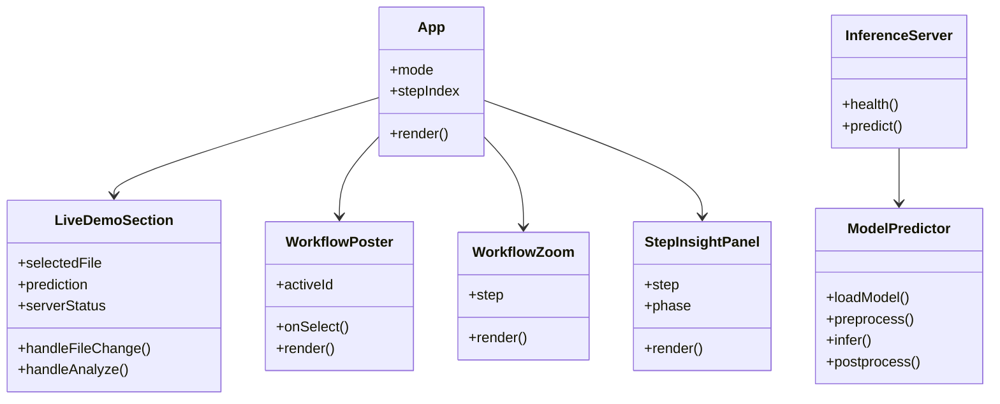
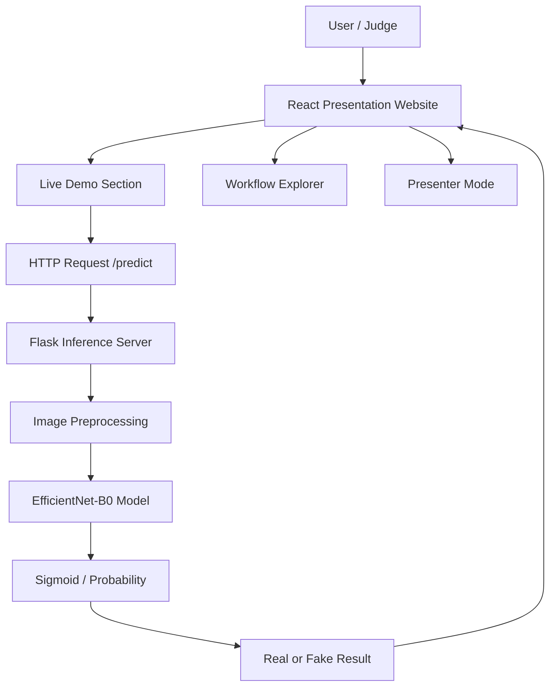
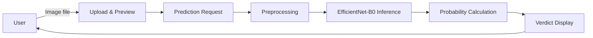
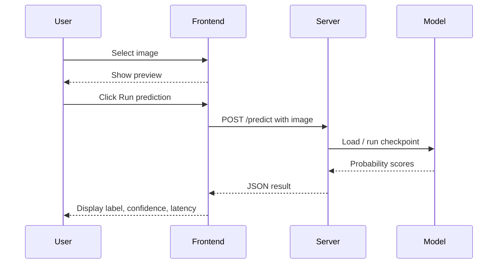
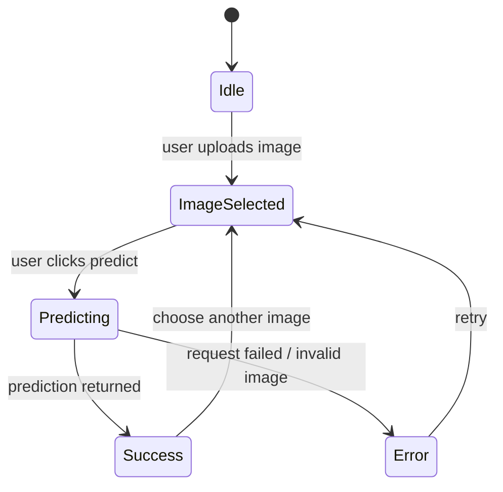
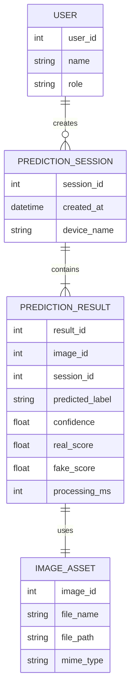

# Design Document

## Project Title
Cross-Dataset Deepfake Detection Using EfficientNet-B0

## 1. Design Overview
The project follows a lightweight layered architecture:
- Presentation layer for explanation and demonstration
- Inference service layer for model execution
- Model layer for EfficientNet-B0 classification

The design supports two goals:
- give judges a live prototype that performs real prediction
- explain the workflow clearly through guided presentation views

## 2. OO Approach

### Main Design Idea
The system uses modular responsibilities instead of a monolithic script:
- UI handles interaction and presentation flow
- inference service handles file reception and prediction
- model handler loads and runs the checkpoint

### Main Logical Objects
- `App`
- `LiveDemoSection`
- `WorkflowPoster`
- `WorkflowZoom`
- `StepInsightPanel`
- `InferenceServer`
- `ModelPredictor`

## 3. Class Diagram

## 4. System Structure / Architectural Diagram

## 5. Data Flow Diagram

## 6. Sequence Diagram

## 7. State Transition Diagram

## 8. Component Responsibilities

### 8.1 Frontend Presentation Layer
- Displays project overview
- Shows results and workflow explanation
- Handles upload preview and live prediction interaction

### 8.2 Inference Service Layer
- Accepts uploaded image
- Validates input
- Applies preprocessing
- Runs model inference
- Returns structured JSON

### 8.3 Model Layer
- Loads `baseline_ffpp_94.pth`
- Uses EfficientNet-B0 architecture
- Produces a binary classification score

## 9. ERD

Even though the current prototype is local and lightweight, the following conceptual ERD supports future logging and result tracking.

## 10. DB Schema

### Table: `users`
| Column | Type | Description |
|---|---|---|
| user_id | INT | Primary key |
| name | VARCHAR | User name |
| role | VARCHAR | Student, examiner, supervisor |

### Table: `prediction_sessions`
| Column | Type | Description |
|---|---|---|
| session_id | INT | Primary key |
| created_at | DATETIME | Session timestamp |
| device_name | VARCHAR | Demo machine identifier |

### Table: `image_assets`
| Column | Type | Description |
|---|---|---|
| image_id | INT | Primary key |
| file_name | VARCHAR | Uploaded image name |
| file_path | VARCHAR | Stored file path |
| mime_type | VARCHAR | Image format |

### Table: `prediction_results`
| Column | Type | Description |
|---|---|---|
| result_id | INT | Primary key |
| image_id | INT | Foreign key to image_assets |
| session_id | INT | Foreign key to prediction_sessions |
| predicted_label | VARCHAR | Real / Fake |
| confidence | FLOAT | Confidence score |
| real_score | FLOAT | Real class probability |
| fake_score | FLOAT | Fake class probability |
| processing_ms | INT | Inference time in milliseconds |

## 11. Design Rationale
- EfficientNet-B0 was selected because it balances compactness and performance.
- A local Flask server was chosen to avoid dependency on internet connectivity during defense.
- The presentation website and model service are separated so the UI remains clean and maintainable.
- Presenter mode is included to improve explanation quality during viva/demo.

## 12. Risks and Future Improvements
- Class mapping should be validated with known real and fake test images before final defense.
- Face-focused inputs should be used because the model was trained on face imagery.
- Future work may include:
  - video-based inference
  - persistent result logging
  - user authentication
  - cloud deployment
