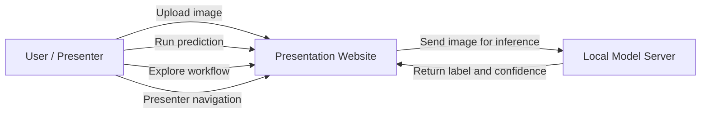

# Software Requirements Specification

## Project Title
Cross-Dataset Deepfake Detection Using EfficientNet-B0

## 1. Introduction

### 1.1 Purpose
This Software Requirements Specification defines the functional, interface, and non-functional requirements for a deepfake detection system that classifies an uploaded facial image as `Real` or `Fake` using an EfficientNet-B0 based model.

### 1.2 Scope
The system is designed for final year project presentation and demonstration. It allows a user to:
- upload a facial image
- run inference through a trained deep learning model
- obtain a prediction label and confidence
- review the workflow and methodology through an interactive presentation website

### 1.3 Intended Users
- Student presenter
- Project supervisor
- Internal examiner / FYP committee
- Future researchers who may extend the system

### 1.4 Product Overview
The product includes:
- a React-based presentation website
- a local Python inference server
- a trained `.pth` model file
- a guided workflow/presenter mode for explanation during defense

## 2. Functional Requirements

### FR-01 Image Upload
The system shall allow the user to upload an input image from the local computer.

### FR-02 Image Preview
The system shall display a preview of the selected image before inference.

### FR-03 Input Validation
The system shall reject empty or unreadable image files.

### FR-04 Prediction Execution
The system shall send the uploaded image to the prediction engine and receive a classification result.

### FR-05 Binary Classification
The system shall classify the input image into one of two classes:
- Real
- Fake

### FR-06 Confidence Display
The system shall display prediction confidence and class scores.

### FR-07 Latency Display
The system shall display the processing time for inference.

### FR-08 Workflow Presentation
The system shall provide a visual explanation of the deepfake detection pipeline.

### FR-09 Presenter Navigation
The system shall support presenter navigation through buttons and keyboard controls.

### FR-10 Step Explanation
The system shall show explanatory text, phase grouping, and terminology for each workflow step.

### FR-11 Health Check
The system shall indicate whether the local model server is available before live demonstration.

### FR-12 Model Loading
The system shall load the trained EfficientNet-B0 checkpoint from the local machine before accepting predictions.

## 3. Interface Requirements

### 3.1 User Interface Requirements
- The homepage shall present the project title, student information, and project summary.
- The website shall contain a live proof section for image upload and prediction.
- The website shall contain a workflow explorer and presenter mode.
- The user interface shall remain readable on desktop and mobile screen sizes.

### 3.2 External Interface Requirements
- The frontend shall communicate with the local inference service via HTTP.
- The prediction endpoint shall accept `multipart/form-data`.
- The prediction endpoint shall return JSON containing label and confidence-related fields.

### 3.3 Software Interface Requirements
- Frontend: React + Vite
- Backend inference runner: Python + Flask
- Deep learning libraries: PyTorch, timm, torchvision

### 3.4 Hardware Interface Requirements
- A laptop or desktop computer with sufficient RAM to load the model
- Camera is optional; the current prototype uses local file upload
- CPU execution is supported for presentation use

## 4. Use Case Descriptions

### UC-01 Upload Image
**Actor:** User  
**Precondition:** Website is open  
**Main Flow:**
1. User clicks `Choose image`
2. User selects an image file
3. System stores the selected image temporarily
4. System displays the image preview

**Postcondition:** Image is ready for inference

### UC-02 Run Prediction
**Actor:** User  
**Precondition:** Image is selected and model server is running  
**Main Flow:**
1. User clicks `Run prediction`
2. System sends the image to the local prediction API
3. Model preprocesses the image
4. Model performs inference
5. System displays label, confidence, scores, and latency

**Postcondition:** Prediction result is shown to the user

### UC-03 Review Workflow
**Actor:** User  
**Precondition:** Website is open  
**Main Flow:**
1. User opens workflow explorer
2. User selects a phase or step
3. System displays workflow explanation, crop, and terms

**Postcondition:** User understands the processing pipeline

### UC-04 Presenter Mode
**Actor:** Presenter  
**Precondition:** Website is open  
**Main Flow:**
1. Presenter switches to presenter mode
2. Presenter navigates through steps using buttons or arrow keys
3. System updates highlighted workflow stage and explanation

**Postcondition:** The presenter can explain the model clearly during defense

## 5. Use Case Diagram

## 6. Non-Functional Requirements

### 6.1 Reliability
- The system shall load the model consistently before live demonstration.
- The system shall return valid JSON for successful predictions.

### 6.2 Availability
- The demo shall remain available locally without requiring internet access.
- The frontend shall show when the model server is online or offline.

### 6.3 Security
- The current prototype is intended for local academic use.
- Uploaded files shall only be processed locally and not sent to third-party services.

### 6.4 Maintainability
- The frontend and inference runner shall be separated into clear modules.
- Model endpoint configuration shall be replaceable without redesigning the UI.

### 6.5 Portability
- The system shall run on a standard Windows-based student machine.
- The frontend can be deployed separately from the local inference runner if needed later.

### 6.6 Performance
- The system shall provide prediction response within acceptable demo time on local hardware.
- The system shall display inference latency to support demonstration quality.

### 6.7 Usability
- The website shall provide a simple upload-and-predict flow for judges.
- The presentation layout shall remain visually clear and readable.

## 7. Assumptions and Constraints

### Assumptions
- The input image contains a face relevant to deepfake detection.
- The `.pth` model file is present on the demonstration machine.

### Constraints
- The current system is optimized for local presentation rather than internet-scale deployment.
- Real-world prediction quality depends on training data quality and class mapping.

## 8. Acceptance Criteria
- User can upload an image successfully
- User can run a live prediction successfully
- System returns a `Real` or `Fake` result
- Workflow and presenter mode are available during defense
- Model server health can be verified before live demo
